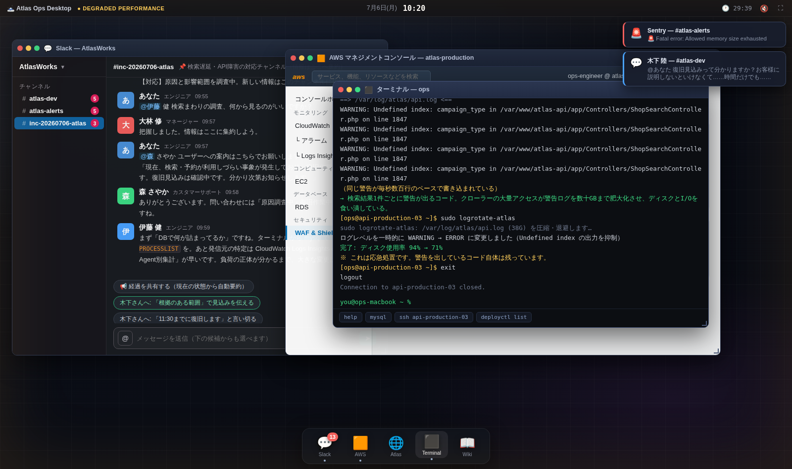
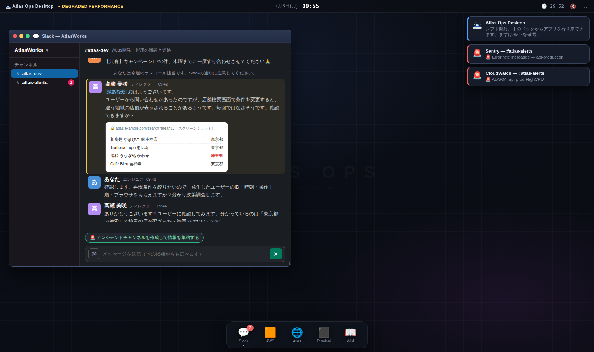
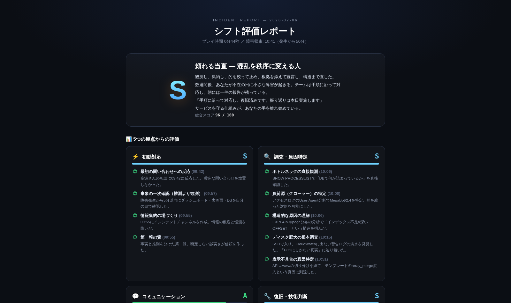

# INCIDENT: 02:17 REAL

> ――そのアラートは、誰かが見つけるまで障害ではない

**リアルタイム障害対応シミュレータ。** [incident-simulator](https://github.com/onopon/incident-simulator)（読み物型のアドベンチャー）を、**「実際にデスクの前に座る」体験**として作り直したものです。

あなたは、15年モノの検索・予約サービス「Atlas」を運用するエンジニア。
ブラウザの中に再現された**デスクトップ環境**で、複数のウィンドウを行き来しながら、リアルタイムに進行する障害へ立ち向かいます。

- 💬 **Slack** ― メンションが飛んでくる。返信・情報集約・第一報・復旧宣言、すべてあなた次第
- 🟧 **AWSコンソール** ― CloudWatchのグラフはライブで動く。EC2の再起動、WAFルール、Logs Insightsでのログ分析
- 🌐 **Atlas本番サイト** ― ユーザーが見ているその画面を自分の目で確認する（本当に遅い・本当に落ちる）
- ⬛ **ターミナル** ― `ssh` / `mysql` / `deployctl` / `repo grep`。手を動かして調査・修復する
- 📖 **社内Wiki** ― 対応手順書と過去の障害レポート。読む者だけが救われる
- 👥 **@メンション** ― ディレクター・CS・営業・先輩エンジニア・マネージャーに状況を聞ける

ゲーム内時間は**現実の8倍速**で流れ続けます。あなたが調査している間も、Slackは鳴り、グラフは悪化し、誰かが返事を待っています。



<details>
<summary>📷 スクリーンショットをもっと見る</summary>

**Slack ― メンション・アラート・行動候補チップ**



**シフト評価レポート ― 5つの観点 × 項目別の判定**



</details>

## 遊び方

### 🐳 Docker で遊ぶ（推奨・一番簡単）

```bash
docker compose up -d
```

ブラウザで <http://localhost:8217> を開いてください（元祖のポート217へのオマージュです）。

終了するとき:

```bash
docker compose down
```

> `docker compose` が使えない環境では `docker-compose up -d`、あるいは
> `docker build -t incident-0217-real . && docker run --rm -p 8217:80 incident-0217-real` でも起動できます。

### Docker を使わない場合

ビルド不要の静的サイトです。任意の静的サーバーで配信してください。

```bash
python3 -m http.server 8217
# → http://localhost:8217
```

（`index.html` を直接開いても動作しますが、静的サーバー経由を推奨します）

### 推奨環境

- **PCのモダンブラウザ**（Chrome / Firefox / Edge）・画面幅 1280px 以上
- **フルスクリーン推奨**（タイトル画面のチェックボックスから）。効果音もぜひONで
- 1プレイ 15〜30分（実時間の制限は30分）

### 中断セーブと再開

- 進行状況は**30秒ごと＋ページ離脱時に自動保存**されます（ブラウザのlocalStorage）。メニューバーの💾で手動保存も可能
- 中断後は、タイトル画面の**「▶ 続きから再開する」**からセーブ地点に復帰できます
- プレイ中の誤リロードには確認ダイアログが出ます。万一リロードしても直前の自動保存から再開できます
- Atlasウィンドウが前面のときの **⌘R / Ctrl+R** は、ゲームではなく**Atlasページのリロード**として扱われます（⌘F / Ctrl+F も同様にページ内検索）

### レポートの共有・出力

シフト評価レポートの画面から3つの形式で共有できます。

| 形式 | 用途 |
| --- | --- |
| 🔗 **共有リンク** | レポート全体をgzip圧縮してURLに埋め込みます。リンクを開いた人は（自分のプレイに影響なく）閲覧専用レポートを見られます。サーバー保存なし |
| 📄 **HTMLファイル** | CSSを内包した単体HTMLをダウンロード。ブラウザで開くだけで表示できるのでSlackやドライブでの共有に |
| 📋 **Markdown** | クリップボードにコピー。SlackやNotion、Wikiへの貼り付けに |

## ゲームの流れ

1. **9:40 シフト開始。** 平和な月曜の朝。Slackにディレクターから曖昧な問い合わせが届く——「検索結果に違う地域の店舗が混ざることがあるようです。毎回ではなさそうです」
2. **9:52 インシデント発生。** Sentry・CloudWatchのアラートが鳴り、Slackが騒がしくなり、Atlasのページが開かなくなる
3. **あなたの自由。** 情報を集約するか、黙って調査するか。ログを分析して的を絞るか、勘でWAFを撃つか。EC2を増やすか（それは本当に効くのか？）、検索を止めるか、本番DBにALTER TABLEを流すか
4. **収束と宣言。** メトリクスを根拠に復旧を宣言する。……その宣言、経過観察はした？ 構造的な対策は入れた？
5. **振り返り。** 「今回の原因は何だったんですか？」への答え方と、改善タスクの選定までがインシデント対応
6. **シフト評価レポート。** 5つの観点 × 項目別に、あなたの判断が時刻つきで評価される

### 評価される5つの観点

| 観点 | 見られていること（例） |
| --- | --- |
| ⚡ 初動対応 | 問い合わせへの反応速度／事象の一次確認／情報集約の場づくり／第一報の質 |
| 🔍 調査・原因特定 | PROCESSLISTでの直接観測／アクセスログからの負荷源特定／構造的原因の理解／EC2ローカルログの発見 |
| 💬 コミュニケーション | 問いかけへの応答率／経過共有のリズム（空白を作らない・連投は1回扱い）とフェーズ網羅／根拠のない約束をしないこと／ユーザー案内の支援／周囲を頼る力 |
| 🔧 復旧・技術判断 | 流入制御の的確さ／ボトルネックの見極め／段階的な再起動／構造への手当て／危険な操作のリスク管理 |
| 🌱 収束・再発防止 | 復旧宣言の質（経過観察）／再発の抑止／残存不具合への対応／振り返りでの原因説明／改善タスクの選定 |

同じ結末でも、**どうやってそこへ辿り着いたか**が評価を分けます。エンディングはプレイスタイルに応じて変化します。

## ヒント（ネタバレなし）

- 困ったら **社内Wiki** を読む。手順書は「パニックのときに次の一手を思い出すため」にある
- **推測より観測。** ダッシュボード・実画面・`SHOW PROCESSLIST`
- ターミナルの下部には、文脈に応じた**コマンド候補**が表示されます
- Slackの **@ボタン** から人に聞ける。先輩エンジニアの伊藤さんは検索まわりの生き字引
- 「毎回ではない」不具合と「全部が遅い」障害は、同じ原因とは限らない

## 技術構成

- 純粋な HTML / CSS / JavaScript（ビルド不要・依存ライブラリなし・外部通信なし）
- 効果音はWebAudioでリアルタイム合成（音声アセットなし）
- 配信は nginx（Docker イメージ: `nginx:1.27-alpine`）

```
├── index.html            # タイトル / デスクトップ / レポートの骨格
├── css/
│   ├── desktop.css       # デスクトップ環境・ウィンドウ・通知・レポート
│   └── apps.css          # Slack / AWS / Atlas / Terminal / Wiki の見た目
├── js/
│   ├── core.js           # イベントバス・ゲーム内時計・状態・メトリクスシミュレーション
│   ├── sound.js          # 効果音（WebAudio合成）
│   ├── wm.js             # ウィンドウマネージャ・ドック・トースト・モーダル
│   ├── apps/
│   │   ├── slack.js      # Slack（チャンネル・チップ・@メンション・NPC返信）
│   │   ├── aws.js        # AWSコンソール（CloudWatch/EC2/RDS/WAF/Logs Insights）
│   │   ├── atlas.js      # 本番サイト（実レイテンシ連動の読み込み・エラー再現）
│   │   ├── terminal.js   # ssh / mysql / deployctl / repo
│   │   └── wiki.js       # 手順書・過去障害レポート
│   ├── scenario.js       # シナリオ本体（タイムライン・NPC・運用オペレーション・メトリクスモデル）
│   ├── report.js         # 振り返りミーティング＆5観点の評価レポート
│   └── boot.js           # 起動処理
├── Dockerfile
└── docker-compose.yml
```

### デバッグ用URLパラメータ（開発者向け）

| パラメータ | 効果 |
| --- | --- |
| `?autostart=1` | タイトルをスキップして即開始（フルスクリーンなし） |
| `?speed=N` | ゲーム内時間の倍速を変更（既定: 8） |
| `?limit=N` | 実時間の制限秒数を変更（既定: 1800） |

例: `http://localhost:8217/?autostart=1&speed=30`

## 元祖との関係

読み物型アドベンチャー（全11シナリオ・エンディング37種）は [onopon/incident-simulator](https://github.com/onopon/incident-simulator) にあります。本リポジトリはその本編「クローラーの千本ノック」の世界観・登場人物を引き継ぎ、**選択肢を読む**のではなく**自分の手で調査・操作・報告する**リアルタイム体験に再構築したものです。
